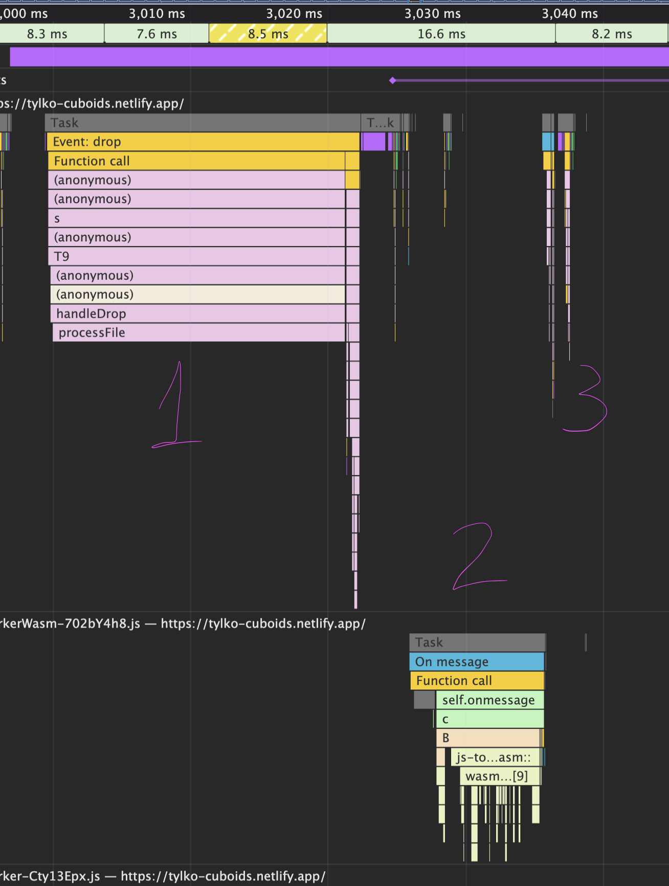

# Tylko Cuboids

A WebGL 2 visualization of cuboid groups defined in CSV files. Built with Vite 7, TypeScript, and Three.js.


Live version: https://tylko-cuboids.netlify.app/


## Results:

For 5000 cuboids, average alogorithm runtime (macOS M1, 16GB RAM, Chrome): 
- Javascript: ~15ms
- Rust(wasm): ~6ms

#
Performance graph: 
- the actual file reading by browser (1) takes longer time than compute (2) itself, while rendering is instantenous. (3)


#


## Setup & Run Instructions

### Prerequisites

- Node.js 22+
- pnpm 9+

### Installation

```bash
# Clone the repository
git clone <repository-url>
cd tylko-cuboids

# Install dependencies
pnpm install
```

### Development

```bash
# Start the development server
pnpm dev
```

The application will be available at `http://localhost:5173`

### Production Build

```bash
# Build for production
pnpm build

# Preview the production build
pnpm preview
```

### Usage

1. Open the application in your browser
2. Drag and drop a CSV file onto the viewport, or use the file input button
3. The cuboids will be grouped by face adjacency and rendered with distinct materials
4. Use mouse controls to navigate:
   - **Left click + drag**: Orbit camera
   - **Right click + drag**: Pan camera
   - **Scroll wheel**: Zoom in/out

---

## CSV File Format

The input CSV file should follow this structure:

```csv
id,x1,y1,z1,x2,y2,z2
1,0,0,0,2,3,4
2,2,3,0,5,5,4
3,10,10,10,15,15,15
```

Where:
- `id` – Unique identifier for the cuboid
- `(x1, y1, z1)` – Start point of the diagonal
- `(x2, y2, z2)` – End point of the diagonal

---

## Grouping Algorithm

Coordinate-based hash maps and iterative flood-fill

### Algorithm structure

Coordinate Indexing: cuboids are indexed by their exact boundary coordinates on each axis. Six hash maps are created—for each axis (X, Y, Z), one map stores cuboids by their minimum coordinate, another by their maximum coordinate. This enables O(1) lookup of potential neighbors that could share a face.

Iterative Flood-Fill: Starting from an unvisited cuboid, the algorithm uses a stack-based flood-fill to discover all connected cuboids. For each cuboid, it queries the coordinate maps to find candidates where:

- A neighbor's max coordinate equals this cuboid's min (touching on negative side)
- A neighbor's min coordinate equals this cuboid's max (touching on positive side)

Candidates are then verified for actual face overlap before being added to the group.

### Optimized Data Structures:

- Pre-allocated buffers to minimize runtime allocations
- Flat Uint16Array for cuboid data to enable efficient interop

### Complexity

- Index building: O(n) where n is the number of cuboids
- Group discovery: O(n × k) where k is the average number of coordinate-matched candidates per cuboid
- Best case: O(n) when cuboids have diverse coordinates (few candidates per lookup)
- Worst case: O(n²) when many cuboids share the same boundary coordinates

## Architecture


The application follows a modular architecture with event driven components.
Central point is internal Api that distrubutes events between modules.
Each module is self contained and responsible for a specific functionality.
Heavy computations are offloaded to Web Workers to keep the UI responsive.


## WebGL 2 Justification

Webgl2 was chosen over WebGPU for practical reasons:

- Browser support - near universal browser support (mobile, desktop, safari, chrome etc)
- Sufficient capability - webGPU could possibly leverage compute shaders for grouping, but provides no significant visual or performance benefit for rendering instanced meshes of cuboids in this use case.
- Development speed - threeJS abstracts webgl2 complexities, allowing faster development and prototyping.


## Performance & Optimizations

- **Web Worker**: All heavy computation (CSV parsing, spatial hashing, grouping) runs in a dedicated worker thread, keeping the main thread free for rendering and user interaction.

- **Inlined Hot Paths**: The face adjacency check (`areFaceAdjacent`) is fully inlined with direct array indexing to eliminate function call overhead in the inner loop.

- **Matrix Reuse**: Transform matrix, position, rotation, and scale vectors are allocated once and reused to avoid GC pressure during mesh setup.


## Limitations

- **File size limits**: Very large CSV files may hit browser memory limits or cause slowdowns due to data transfer and parsing time, or fail completely.

- **Single-Threaded Grouping**: While parsing runs in a Web Worker, the grouping is still single-threaded. It would be hard to parallelize single file computation due to the interconnected nature of the flood-fill algorithm, but multiple files could be processed in parallel.

- **Worker Data Transfer**: Data is copied between main thread and worker (no `SharedArrayBuffer`). For very large datasets, this could be optimized with transferable objects or shared memory.

- **No LOD or Culling**: All cuboids are rendered at full detail regardless of camera distance. Very large scenes may benefit from level-of-detail or frustum culling.
